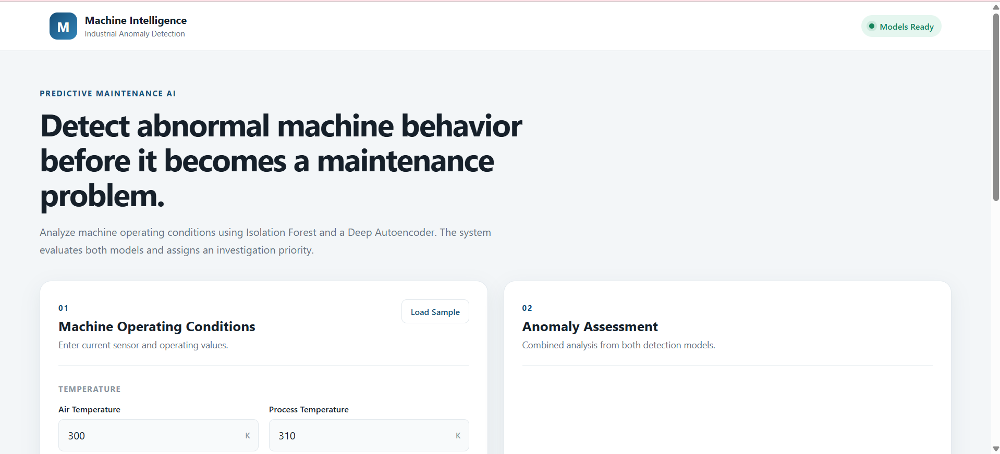
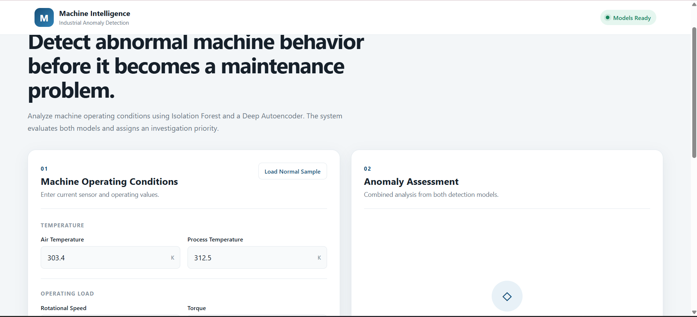
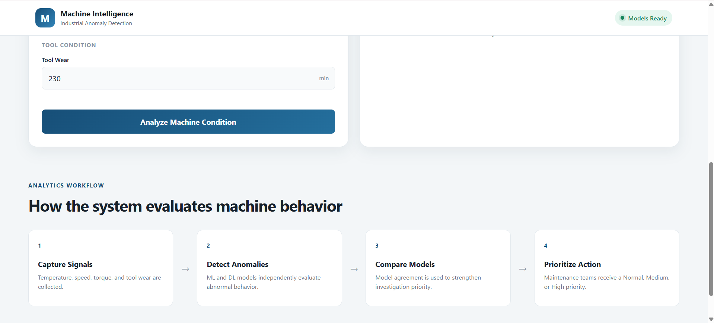
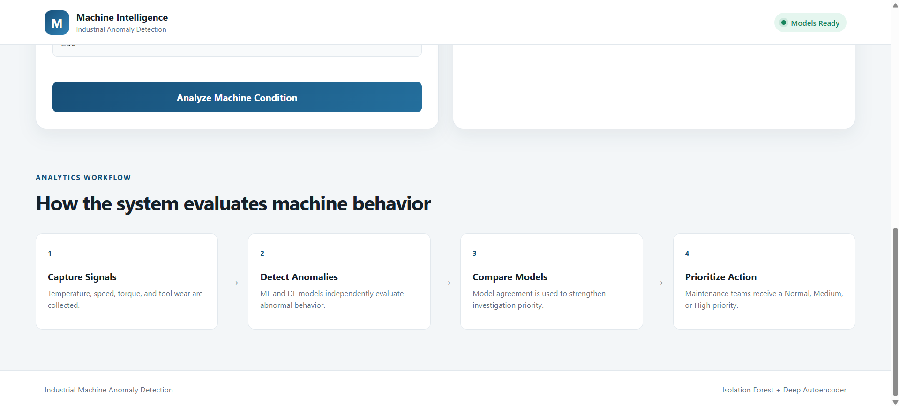

# Industrial Machine Anomaly Detection

An end-to-end Machine Learning and Deep Learning project for detecting abnormal machine operating conditions using Isolation Forest and a Deep Autoencoder.

The project uses industrial machine operating data to identify unusual patterns in temperature, rotational speed, torque, and tool wear.

## Project Objectives
The goal of this project is to:

* Detect abnormal machine operating conditions,
* Compare Machine Learning and Deep Learning approaches,
* Generate anomaly scores for machine prioritization,
* Support maintenance investigation and predictive maintenance use cases.
## Data Set
This project uses the AI4I 2020 Predictive Maintenance Dataset.

Main features used:

* Air Temperature
* Process Temperature
* Rotational Speed
* Torque
* Tool Wear
* Machine Failure
## Models Used
### Isolation Forest

Isolation Forest is used for unsupervised anomaly detection on machine operating data.

It identifies unusual combinations of operating conditions and generates an anomaly score for each machine record.

### Deep Autoencoder

The Autoencoder is trained mainly on normal machine operating data.

It learns normal machine behavior and identifies anomalies using reconstruction error.

High reconstruction error indicates that the current operating pattern is significantly different from normal behavior.
## Project Workflow
```text
Dataset
    ↓
Data Understanding
    ↓
Data Cleaning
    ↓   
Exploratory Data Analysis
    ↓
Feature Scaling
    ↓
Isolation Forest
    ↓
Deep Autoencoder
    ↓
Model Evaluation
    ↓
ML vs DL Comparison
    ↓
Anomaly Ranking and Visualization


```
## Project Structure
```text
machine-anomaly-detection/ 
│ 
├── data/ 
│ └── predictive_maintenance.csv
│ ├── notebooks/ 
│ ├── 01_data_understanding.ipynb 
│ ├── 02_eda.ipynb 
│ ├── 03_statistical_anomaly.ipynb 
│ ├── 04_isolation_forest.ipynb 
│ ├── 05_autoencoder.ipynb 
│ └── 06_model_comparison.ipynb 
│ ├── models/ 
├── src/ 
├── app.py 
├── requirements.txt 
└── README.md
```
## Technology Stack
* Python
* Pandas
* NumPy
* Matplotlib
* Scikit-learn
* TensorFlow
* Keras
* Flask
## Key Learning Outcomes
This project demonstrates:

* Exploratory Data Analysis
* Data preprocessing
* Feature scaling
* Statistical anomaly detection
* Isolation Forest
* Deep Autoencoder
* Reconstruction error
* Anomaly threshold selection
* Model evaluation
* Machine Learning vs Deep Learning comparison
* Industrial AI application development

## Model Results
```markdown
| Model | Precision | Recall | F1 | ROC AUC |
|---|---:|---:|---:|---:|
| Isolation Forest | 0.1282 | 0.1471 | 0.1370 | 0.8507 |
| Autoencoder | 0.1071 | 0.1765 | 0.1333 | 0.6833 |

```

## Future Improvements

* AWS deployment
* CI/CD enhancement
* Model registry
* Model monitoring
* Drift detection

## Front End Samples




